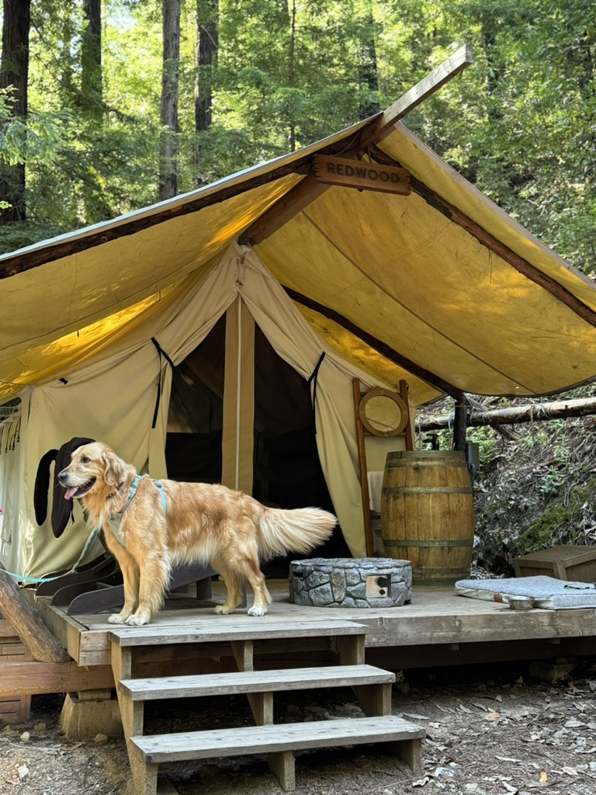

---
# Feel free to add content and custom Front Matter to this file.
# To modify the layout, see https://jekyllrb.com/docs/themes/#overriding-theme-defaults

layout: home
---

# About Me

{: style="float: right; margin-left: 20px; width: 150px;"}

Hello! I am a master’s student in Computer Science at Northeastern University. I am passionate about creating efficient, user-centered applications and am currently seeking an internship in the tech industry.

In my spare time, I'd like to spend time outside with my family and my dog Jojo who is an 80-pound golden retriever.